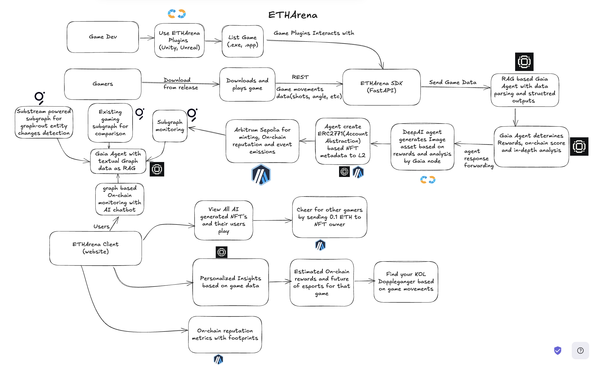

# ETHArena 🎮 

ETHArena: Where Gaming Meets Web3 Evolution. Your AI agent analyzes every move, forges epic moments into NFTs, and guides your path to esports glory. 

Game-embedded performance tracking meets on-chain rewards, transforming casual plays into professional legacies. 🎮

## Table of Contents

- [Deployments](#deployments)
- [Flow Chart and System Design](#system-architecture)
- [Problem Statement](#-problem-statement)
- [Solution](#-solution)
- [Multi Agent System Architecture](#multi-agent-system-architecture)
- [Tech stack](#-tech-stack)
- [Local Installation](#-local-installation)
- [Partners and Integrations](#partnerships-and-integrations)
  - [Arbitrum](#1-arbitrum-integration)
  - [The Graph](#2-the-graph-integration)
  - [Gaia and Collab.land](#3-gaiacollabland-integration)
  - [Nethermind](#4-nethermind-integration)
- [Contributing](#-contributing)
- [License](#-license)
## Deployments

- Frontend: [ETHArena Platform](https://eth-arena.vercel.app/)
- Backend: [ETHArena SDK API](https://basearena.onrender.com/)
- Smart Contract [View on Arbitrum  Etherscan](https://sepolia.arbiscan.io/tx/0x2d097a604a4af24bcc7e801667db4d5acc8da0eca568ad771da71e831733c029)

## 📐 System Architecture



## 🎯 Problem Statement

The Web3 gaming ecosystem faces several critical challenges:

1. **Distribution Fragmentation**
   - Web2 gaming platforms like Steam command 45% of the global market
   - Web3 games lack unified distribution channels
   - No standardized platform for discovering blockchain games

2. **Complex User Experience**
   - High barrier to entry with wallet setup requirements
   - Fragmented reward systems across different games
   - Disconnected gaming experiences between different blockchain networks

3. **Technical Limitations**
   - Manual NFT generation processes
   - No unified reputation system across game engines
   - Limited on-chain reward mechanisms
   - Privacy concerns with gameplay data

## 💡 Solution

ETHArena revolutionizes Web3 gaming through:

1. **Seamless Integration**
   - Unity/Unreal Engine plugins for easy developer onboarding
   - Account abstraction (ERC2771) for gasless transactions
   - Invisible blockchain integration for players

2. **AI-Powered Gaming**
   - Real-time gameplay analysis
   - Personalized performance insights
   - Dynamic NFT generation based on gameplay
   - Gaming doppelganger matching system

3. **Unified Platform**
   - Cross-engine compatibility
   - Standardized reward system
   - Integrated reputation tracking
   - Community-driven appreciation mechanism

## 🔧 Technical Deep Dive

### Architecture Components

1. **ETHArena SDK**
   - Fast API backend processing game movements
   - Real-time data parsing and structuring
   - Integration with AI agents
   - Account abstraction layer

2. **AI Agents**
   - RAG-based Gaia Agent for performance analysis
   - DeepAI integration for NFT generation
   - Substream-powered subgraph for entity changes
   - Graph-based monitoring system

3. **Smart Contracts**
   - ERC2771 implementation for account abstraction
   - Arbitrum Sepolia integration for minting and events
   - On-chain reputation tracking
   - Reward distribution system

### Innovation in Gaming
- Gaming reputation system on Arbitrum
- Automated SBT minting based on gameplay achievements
- Real-time monitoring and reward distribution
- Future expansion into game licensing platform


## Multi-Agent System Architecture:

- Game Companion Agent: Monitors gameplay and provides real-time advice
Code : https://github.com/dhananjaypai08/ETHArena/blob/master/ETHArenaSDK/main.py#L109

- DeepAI Agent: Generates unique NFT assets based on gameplay data
Code : https://github.com/dhananjaypai08/ETHArena/blob/master/ETHArenaSDK/main.py#L268

- Gaia Agent: Handles on-chain interactions and reward distribution
Code. : https://github.com/dhananjaypai08/ETHArena/blob/master/ETHArenaSDK/baseAgent.py#L165

- RAG-based Analysis Agent: Processes game metrics and provides structured insights
Code : https://github.com/dhananjaypai08/ETHArena/blob/master/ETHArenaSDK/baseAgent.py#L11

- Account abstraction (ERC2771) for frictionless onboarding of traditional gamers
Code : 
https://github.com/dhananjaypai08/ETHArena/blob/master/ETHArenaSDK/main.py#L218

## 🛠 Tech Stack

- **Frontend**: React, TailwindCSS, Framer Motion
- **Backend**: FastAPI, Python
- **Blockchain**: Rust, Stylus SDK, Arbitrum, Ethers, Solidity
- **AI/ML**: DeepAI, Gaia
- **Game Engines**: Unity (C#), Unreal
- **Infrastructure**: Render, Vercel

## 📦 Local Installation

### Frontend Setup
```bash
# Clone the repository
git clone https://github.com/dhananjaypai08/ZkDNS.git

# Install dependencies
cd frontend
npm install

# Set up environment variables
cp .env.example .env
# Add your configuration

# Start development server
npm run dev
```

### Backend Setup
```bash
# Navigate to backend directory
cd backend

# Create virtual environment
python -m venv venv
source venv/bin/activate  # or `venv\Scripts\activate` on Windows

# Install dependencies
pip install -r requirements.txt

# Set up environment variables
cp .env.example .env
# Add your configuration

# Start the server
python3 main.py
```

## Partnerships and Integrations

### 1. Arbitrum Integration
#### Deployment 
Deployed SBT contract on Arbitrum Sepolia: https://sepolia.arbiscan.io/address/0xF34814Bb28fC0a3076105c509D39edf4Ff00530e

#### Usage 
Utilized Stylus SDK with erc721.rs for NFT implementation
Code : https://github.com/dhananjaypai08/ETHArena/blob/master/stylus-contracts/src/erc721.rs

I have a release for the Unity based game here : https://github.com/dhananjaypai08/ETHArena/releases/tag/mac


### 2. The Graph Integration
#### Comprehensive Integration of Multiple Subgraphs 

- Substream-Powered Subgraph
Query URL: https://api.studio.thegraph.com/query/103194/djsubstream/version/latest
Real-time entity change monitoring using graph-out method

- Custom Event-Based Subgraph:
Query URL: https://api.studio.thegraph.com/query/103194/etharenasubgraph/version/latest
Tracks smart contract events and gameplay metrics


- Game Movement Monitoring Subgraph(Existing subgraph):
Query URL: https://thegraph.com/explorer/subgraphs/Fs8CXT44JRnPrG8ipustHyPwqAg8d3xcgFUW4ogkCb6g
Analyzes on-chain game interactions


#### Technical Excellence
- Subgraph tracks game movements and on-chain rewards with Gaia Agent at its core 
- Integration of multiple data sources for comprehensive analytics with Gaia Agent
- Real-time monitoring system using substream powered subgraph(deployed using github workspace)
- Custom indexing solutions for gaming metrics
- AI-powered chatbot utilizing Graph data through RAG


### 3. Gaia/Collab.land Integration
#### Overview
Our project leverages a custom Gaia node (https://0x0c8923d457934eae1a4ce708f07a980f1ce57a32.gaia.domains/ , node might be stopped) as the core reasoning engine, demonstrating extensive integration capabilities:


#### Multi-chain Operations
- Primary gameplay data on Ethereum
- Reputation system on Arbitrum Sepolia
- Cross-chain reward distribution


#### Platform Integration
- Unity Game Engine integration
- Web client interface
- On-chain analytics dashboard


#### Advanced Agent Capabilities
- Real-time game movement analysis
- Text-based RAG for structured data outputs
- Automated SBT generation and minting
- Treasury management through smart contracts
- Social engagement through "cheering" system

I have a release for the Unity based game here : https://github.com/dhananjaypai08/ETHArena/releases/tag/mac


### 4. Nethermind Integration
ETHArena revolutionizes the gaming ecosystem by creating an autonomous agent system that bridges the gap between traditional gaming and blockchain technology. Our implementation directly addresses Nethermind's vision of autonomous agents driving on-chain activity.

I have a release for the Unity based game here : https://github.com/dhananjaypai08/ETHArena/releases/tag/mac

### Key Technical Implementations:

#### Innovation Highlights:

- Seamless integration of AI agents with Unity game engine through our custom SDK
- Account abstraction (ERC2771) for frictionless onboarding of traditional gamers
Code : 
https://github.com/dhananjaypai08/ETHArena/blob/master/ETHArenaSDK/main.py#L218
- Real-time game movement analysis and automated reward distribution
- Novel approach to gaming reputation through AI-generated "gaming dopplegangers"

Future Roadmap and Starknet Integration:
- Implementation of StarknetKit for enhanced wallet connectivity
- Development of smart contracts in Cairo

#### Phase deployment approach to pivot to Nethermind Exosystem:
- Initial testnet release for validation
- Subsequent mainnet deployment
- Integration with Starknet's native agent toolkit
- Immediate applicability to the $200B+ gaming market
Clear path to adoption through Unity plugin ecosystem
Scalable architecture supporting multiple game engines
- Foundation for future expansion into esports and competitive gaming


## 🤝 Contributing

We welcome contributions to ETHArena! Here's how you can help:

1. Fork the repository
2. Create your feature branch (`git checkout -b feature/AmazingFeature`)
3. Commit your changes (`git commit -m 'Add some AmazingFeature'`)
4. Push to the branch (`git push origin feature/AmazingFeature`)
5. Open a Pull Request

## 📄 License

This project is licensed under the MIT License - see the [LICENSE](LICENSE) file for details.
